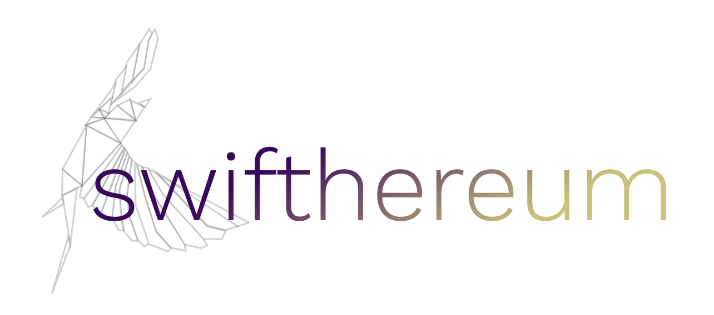

# Swifthereum

[](https://travis-ci.org/git/Swifthereum)
[](http://cocoapods.org/pods/Swifthereum)
[](http://cocoapods.org/pods/Swifthereum)
[](http://cocoapods.org/pods/Swifthereum)



Swifthereum is a native Swift framework that provides access to the [Go Ethereum](https://github.com/ethereum/go-ethereum/) framework in a Swift-friendly way. Swifthereum makes it easy and fast to develop native dApps on iOS and MacOS.

## Versions

Swifthereum supports the following Ethereum interfaces:

- Web3 Interface

	The default interface will either connect to a local Geth instance over HTTP or a service like [Infura](https://infura.io) over HTTPS.
	
- IPC

	Not supported yet.
	
- Mobile Geth API (**Experimental**. iOS only)

	Swifthereum wraps the Mobile Geth framework into a Swift friendly framework. Mobile Geth is only available for iOS, not for MacOS. Mobile Geth runs a Ethereum light node on the iOS device and will need to sync with the Ethereum network to work.
	
	Mobile Geth is highly experimental and the current version is not Swift friendly. It is not recommended to use the Geth API in products. Instead, use the Web3 interface.
	

## Common Features

Swifthereum includes support for ERC-20 tokens and provides a download option to download a list of the latest tokens.

## Examples

iOS and Mac examples can be found in the [Examples directory](Examples/).

## Requirements

- iOS 9 and later (QRCodeScanner example requires iOS 11)
- MacOS 10.10 and later (coming soon)
- Swift 4.0 and later

## Swifthereum Web3 Installation

The Swifthereum Web3 framework is available through [CocoaPods](http://cocoapods.org). To install it, simply add the following line to your Podfile:

```ruby
pod 'Swifthereum'
```

## Swifthereum Mobile Geth Installation

The experimental Geth API framework does not support Cocoapods, as the current Geth framework is a static framework and therefore cannot be used as a Cocoapods dependency. To use the Geth API, add Geth to your podfile and then manually copy the Swifthereum Geth files to your project. This issue is tracked as Geth issue [#15272](https://github.com/ethereum/go-ethereum/issues/15272).

```ruby
pod 'Geth'
```


## Usage

### Basics (Depricated)

Start an Ethereum node as part of the main network and synchronize with the Ethereum network:

````swift
do {
	let node = try Node(networkID: .main)
	try node.start()
	let client = try node.ethereumClient()
} catch {
	// Handle error
}
````

A node on the Rinkeby test network can be easily created by invoking ````let node = try Node(networkID: .rinkeby)````.

The balance of an address can easily be queried, formatted and displayed as either ETH, WEI, GWEI and any of the other standard Ethereum units.

````swift
do {
	let address = try Address(hex:"0x548429264DAcf79e7c96aC00D3d12760922d4c31")
	let balance = try client.balance(for: address)
	print("Balance: \(balance) WEI")
} catch {
	// Handle errors
}
````

Balances can easily be formatted for printing:

````swift
print("\(balance.formattedBalance(.ether, decimals: 6)) ETH")
print("\(balance.formattedBalance(.gwei)) GWEI")
print("\(balance.formattedBalance(.szabo)) MICRO")
print("\(balance.formattedBalance(.micro)) MICRO")
````


The latest list of ERC-20 tokens can be fetched using the following code.

````swift
ERC20Token.fetchTokens { tokens, error in 
	guard let tokens = tokens, let kinToken = tokens.filter { $0.symbol == "KIN" }.first else {
		// Handle error
	}
	do {
		let kinBalance = try Address(hex:"0x548429264DAcf79e7c96aC00D3d12760922d4c31")
		let balance = try client.balance(for: address, token: kinToken) 
		print("Balance: \(balance.formattedBalance()) KIN")
	} catch {
		// Handle error
	}
}
````

## Known Limitations Mobile Geth API

Swifthereum was developed as part of Indisputable Lab's entry for the Consensys BSIC hackathon. The current version is a pre-release and should not be used in production.

- Swifthereum has not been thouroughly tested.
- The Swifthereum API will change radically. A major refactoring of the code is planned. 
- As of Geth 1.7.1, Geth passes variables as implicitly unwrapped optionals (e.g. ````GethAddress!````) by default. Swifthereum does not check for nil pointers and will crash if Geth passes a nil pointer as an implicitly unwrapped optional, which can happen. This issue is tracked as Geth issue [#15240](https://github.com/ethereum/go-ethereum/issues/15240).
- The Geth API is not fully implemented yet.
- Some GETH methods sometimes seem to block the main thread for a few seconds. One possibility is to refactor all Swifthereum calls as asynchronous. This would also open up the possibility of using Web3 with the same interface for use with for example (Infura)[https://infura.io]. Feedback is welcome.

## Dependencies

Swifthereum uses the [BigInt](https://github.com/attaswift/BigInt) framework to store int256 variables such as balances.

## Contribution

Thank you for your interest in the project. We appreciate contributions.

Make sure to read our guides first:

- Code of Conduct (TODO)
- Contribution Guidelines (TODO)

## Authors and Contributors

Swifthereum is an initiative by Indisputable Labs and designed, written and maintained by:

- [Ronald Mannak](https://github.com/ronaldmannak). [Twitter](https://twitter.com/ronaldmannak). 
- [Jenny Guan](https://github.com/jnyguan)

## License

Swifthereum is available under the MIT license. See the [LICENSE](LICENSE) file for more info.
